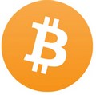

# $$$START$$$

## What is Blockchain? 

 

A blockchain is a special type of database. You may also have heard the term `distributed ledger` technology (or DLT) – in many cases, they're referring to the same thing.

A blockchain has certain unique properties. There are rules about how data can be added, and once the data has been stored, it's virtually impossible to modify or delete it.

### What Blockchain is NOT!

 
Blockchain is not **Bitcoin**, but it is the technology behind Bitcoin
Bitcoin is the digital token and blockchain is the ledger to keep track of who owns the digital tokens
You can't have Bitcoin without blockchain, but you can have blockchain without Bitcoin.

## What is Cryptocurrency?

 
A cryptocurrency is a digital currency and is classified as a subset of alternative currencies and virtual currencies.
 

### Blockchain Architecture 

 
A Blockchain is a chain of blocks which contain information. The data which is stored inside a block depends on the type of blockchain.

The first block in the chain is called the Genesis block. Each new block in the chain is linked to the previous block.

### Understanding SHA256 - Hash

 
A block also has a hash. A can be understood as a fingerprint which is unique to each block. It identifies a block and all of its contents, and it's always unique, just like a fingerprint. So once a block is created, any change inside the block will cause the hash to change.

#### Each Block has;

* Data
* Hash
* Hash of the previous block

 
### Wallet 
A transaction’s *private* and *public* keys are stored in the blockchain wallet store.

#### Wallet types

 
In bitcoin, there are different types of wallets that can be used to store private keys. As a
software program, they also provide some functions to the users to manage and carry out
transactions on the bitcoin network. 

##### Hot Wallets and Cold Wallets

 
Hot wallets are online wallets through which cryptocurrencies can be transferred quickly. They are available online. Examples are Coinbase and Blockchain.info. Cold wallets are digital offline wallets where the transactions are signed offline and then disclosed online. They are not maintained in the cloud on the internet; they are maintained offline to have high security. Examples of cold wallets are Trezor and Ledger. 

### Proof of Work

 
This type of consensus mechanism relies on proof that enough computational resources
have been spent before proposing a value for acceptance by the network. This is used in
bitcoin and other cryptocurrencies. Currently, this is the only algorithm that has proven
astonishingly successful against Sybil attacks

### Peer to Peer Protocol 

 
P2P protocol in the Hyperledger Fabric is built using google RPC (gRPC). It uses protocol
buffers to define the structure of the messages.
Messages are passed between nodes in order to perform various functions. There are four
main types of messages in Hyperledger Fabric: Discovery, transaction, synchronization and
consensus. Discovery messages are exchanged between nodes when starting up in order to
discover other peers on the network.

### How Blockchain Transaction Works?

 

A `transaction` is the fundamental unit of a blockchain. A transaction represents a transfer of
value from one address to another.

*Step 1) Some person requests a transaction. The transaction could be involved cryptocurrency, contracts, records or other information.*

*Step 2) The requested transaction is broadcasted to a P2P network with the help of nodes.*

*Step 3) The network of nodes validates the transaction and the user's status with the help of known algorithms.*

*Step 4) Once the transaction is complete the new block is then added to the existing blockchain. In such a way that is permanent and unalterable.*

 

 

### Why do we need Blockchain?
`Time reduction`: In the financial industry, blockchain can play a vital role by allowing the quicker settlement of trades as it does not need a lengthy process of verification, settlement, and clearance because a single version of agreed-upon data of the share ledger is available between all stack holders.

`Reliability`: Blockchain certifies and verifies the identities of the interested parties. This removes double records, reducing rates and accelerates transactions.

`Unchangeable transactions`: By registering transactions in chronological order, Blockchain certifies the unalterability, of all operations which means when any new block has been added to the chain of ledgers, it cannot be removed or modified.

`Fraud prevention`: The concepts of shared information and consensus prevent possible losses due to fraud or embezzlement. In logistics-based industries, blockchain as a monitoring mechanism act to reduce costs.

`Decentralized`: There are standards rules on how every node exchanges the blockchain information. This method ensures that all transactions are validated, and all valid transactions are added one by one.

### Blockchain Versions 
 

### Blockchain Uses 

| Markets  |IOT   |Government   | Finance & Accounting  |  Health |
|---|---|---|---|---|
| Billing, monitoring   | Digital Assistants | Voting, propositions P2P bond   | Digital Currency Payment  |  Universal EMR Health databanks | 
| Quota management in the Supply Chain Network  |  Smart home networks |  Digitization of documents/ contracts and proof of ownership for transfers | Digital Currency Payment  | Health Token  |
| Data Transfer   | Integrated smartcity  | Registry & Identify  | Bookkeeping  | Digital health wallet Smart property  |

### BlockChain and Bitcoin:

 
The blockchain is the technology behind Bitcoin. Bitcoin is the digital token, and blockchain is the ledger that keeps track of who owns the digital tokens. You can't have Bitcoin without blockchain, but you can have blockchain without Bitcoin.

Other prominent cryptocurrencies:
1. Ethereum
2. Bitcoin Cash
3. Ripple
4. Litecoin

### Mining

 
Mining is a resource-intensive process by which new blocks are added to the blockchain.
Blocks contain transactions that are validated via the mining process by mining nodes and
are added to the blockchain. This process is resource-intensive in order to ensure that the
required resources have been spent by miners in order for a block to be accepted. New coins
are minted by the miners by spending the required computing resources. This also secures
the system against frauds and double spending attacks while adding more virtual currency
to the bitcoin ecosystem.

### Consensus

 
Consensus is a process of agreement between distrusting nodes on a final state of data. In
order to achieve consensus different algorithms can be used. It is easy to reach an
agreement between two nodes (for example in client-server systems) but when multiple
nodes are participating in a distributed system and they need to agree on a single value it
becomes very difficult to achieve consensus. This concept of achieving consensus between
multiple nodes is known as distributed consensus.

#### Consensus mechanisms
A `consensus` mechanism is a set of steps that are taken by all, or most, nodes in order to
agree on a proposed state or value. For more than three decades this concept has been
researched by computer scientists in the industry and Academia. Consensus mechanisms
have recently come into the limelight and gained much popularity with the advent of
bitcoin and blockchain.

>> There are various requirements which must be met in order to provide the desired results in
>> a consensus mechanism. The following are their requirements with brief descriptions:
1. **Agreement**: All honest nodes decide on the same value.
2. **Termination**: All honest nodes terminate execution of the consensus process and
eventually reach a decision.
3. **Validity**: The value agreed upon by all honest nodes must be the same as the
initial value proposed by at least one honest node.
4. **Fault tolerant**: The consensus algorithm should be able to run in the presence of
faulty or malicious nodes (Byzantine nodes).
5. **Integrity**: This is a requirement where by no node makes the decision more than
once. The nodes make decisions only once in a single consensus cycle.

### Summary
* A Blockchain is a chain of blocks that contain information
*  The blockchain is not Bitcoin, but it is the technology behind Bitcoin
* Every block contains hash.
* Each block has a hash of the previous block
* Blockchain require Proof of Work before a new block is added
* The blockchain database is disturbed amongst multiple peers and is not centralized.
* Block chain technology is Resilience, Decentralize, Time reducing, reliable and its offers unalterable transitions
* Three versions of Blockchain are Blockchain 1.0: Currency, Blockchain 2.0: Smart Contracts and Blockchain 3.0: DApps
* The blockchain is Available in three different variants 
~~~~
1) Public 2) Private 3) Consortium
~~~~
* Higher cost, slower transactions, small ledger, the risk of error are some disadvantage of using this technology
* Dubai- The Smart City, Incent Customer retention, and Blockchain for Humanitarian Aid are the real-life use cases of Blockchain
* Bitcoin uses blockchain technology which is not governed by any central authority or banks

# $$$END$$$
