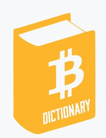

# $$$START$$$

# A

## Address (Wallet Address)
Used to send and receive transactions on a blockchain network. An address is an alphanumeric character string, which can also be represented as a scannable QR code.

## Airdrop
A token distribution method used to send cryptocurrency or tokens to wallet addresses. Sometimes airdrops are used for marketing purposes in exchange for simple tasks like reshares, referrals, or app downloads.

## Air-gapping
A method for securing computers in which the device does not connect to the internet or any other open networks.

## Altcoin
Any digital currency alternative to Bitcoin. Many altcoins are forks [see below for definition] of Bitcoin with minor changes (e.g., Litecoin).

## API (Application Programming Interface)
Application Programming Interface. A software intermediary that allows two separate applications to communicate with one another. APIs define methods of communication between various components.

## ASIC (Application Specific Integrated Circuit)
Application Specific Integrated Circuit. ASICs are silicon chips designed to do a specific task. In ASIC use for mining cryptocurrencies, the ASIC will perform a calculation to find values that provide a desired solution when placed into a hashing algorithm.

# B
## Bitcoin (BTC)
The first cryptocurrency based on the Proof of Work blockchain. Bitcoin was created in 2009 by Satoshi Nakomoto — a pseudonym for an individual whose real identity is unknown — and the concept of cryptocurrency was outlined in a white paper titled “Bitcoin: A Peer-to-Peer Electronic Cash System.”

## Block 
A container or collection of transactions occurring every time period on a blockchain.

## Blockchain
A consensus digital ledger comprised of unchangeable, digitally recorded data in packages called blocks. Each block is ‘chained’ to the next block using a cryptographic signature. This allows blockchains to act like a ledger, which can be shared with and accessed by anyone with the appropriate permissions. Click here to learn more about blockchain.

## Block explorer
An online tool for exploring the blockchain of a particular cryptocurrency, where you can watch and follow live all the transactions happening on the blockchain. Block explorers can serve as blockchain analysis and provide information such as total network hash rate, coin supply, transaction growth, etc.

## Block Height
The number of blocks connected together in the blockchain. For example, Height 0 would be the very first block, which is also called the Genesis Block.

## Block Reward
The reward given to a miner after it has successfully hashed a transaction block. Block rewards can be a mixture of coins and transaction fees. The composition depends on the policy used by the cryptocurrency in question, and whether all of the coins have already been successfully mined. The current block reward for the Bitcoin network is 12.5 bitcoins per block.

## Bounty / Bug Bounty
A reward that’s paid for the completion of a given task. Tasks include identifying code vulnerabilities, creating content, design work, research, translations, social impact and more.

# C
## Chain linking
Chain linking is the process of connecting two blockchains with each other, thus allowing transactions between the chains to take place. This will allow blockchains like Bitcoin to communicate with other sidechains, allowing the exchange of assets between them.

## Client
Software that accesses a blockchain via a local computer and helps to process transactions. A client usually includes a cryptocurrency software wallet.

## Coin
A coin or altcoin is a representation of digital asset value that is generated via their own independent blockchain.

## Cold Wallet / Cold Storage
An offline wallet that is never connected to the internet. These wallets protect cryptocurrencies from getting hacked online.

## Context-sensitive
 Depending on the context. Changing it’s content depending on its surroundings.

## Context-sensitive Help
 Immediate assistance and information to users without requiring users to leave the context in which they are working.

## Confirmation / Block Confirmation
A confirmation means that the network has verified the blockchain transaction. This happens through a process known as mining, in a Proof of Work system (e.g., Bitcoin). Once a transaction is successfully confirmed it theoretically cannot be reversed or double spent. The more confirmations a transaction has, the harder it becomes to perform a double spend attack.

## Consensus
The process used by a group consisting of peers that is responsible for maintaining distributed ledger use. The way to reach consensus on the use of the ledger’s contents.

## Cryptocurrency
Digital currency that is based on mathematics and uses encryption techniques to regulate the creation of units of currency as well as verifying the transfer of funds. Cryptocurrencies operate independently of a central bank.

 ## Cryptography
A method for secure communication using code. Symmetric-key cryptography is used by various blockchain networks for transfer of cryptocurrencies. Blockchain addresses generated for wallets are paired with private keys that allow transfer of cryptocurrency. Paired public and private keys allow funds to be unlocked.

# D
## DAO (digital decentralized autonomous organization)
Also known as the digital decentralized autonomous organization (DAO). Alternatively, the first known example of a DAO was named The DAO. The DAO served as a form of investor-directed venture capital fund, which sought to provide enterprises with new decentralized business models. Ethereum-based, The DAO’s code was open source. The organization set the record for the most crowdfunded project in 2016, however, those funds were partially stolen by hackers. The hack caused an Ethereum hard-fork which lead to the creation of Ethereum Classic.

## Decentralization
The transfer of authority and responsibility from a centralized organization, government, or party to a distributed network.

## Decentralized Application (dapp)
An open source, software application with backend code running on a decentralized peer-to-peer network rather than a centralized server.

## Decentralized Finance (DeFi)
Decentralized finance—often called DeFi or open finance—refers to the economic paradigm shift enabled by decentralized technologies, particularly blockchain networks. DeFi represents a shift from a centralized and closed financial system to a universally accessible economy that is based on open protocols that are interoperable, programmable, and composable.

## Deposit
Digital property put into a contract involving a different party such that if certain conditions are not satisfied that property is automatically forfeited to the identified counterparty.

## Digital Asset
A digital commodity that is scarce, electronically transferable, and intangible with a market value.

## Digital Identity
An online or networked identity adopted by an individual, organization, or electronic device.

## Digital Signature
A code generated by public key encryption and attached to an electronically transmitted document in order to verify the contents of the document.

## Distributed Denial of Service (DDoS) Attack
A type of cyber-attack in which the perpetrator continuously overwhelms the system with requests in order to prevent service of legitimate requests.

## Distributed Ledger
A type of database which spreads across multiple sites, countries, or institutions. Records are stored sequentially in a continuous ledger. Distributed ledger data can be either “permissioned” or “unpermissioned” to control who can view it.

## Difficulty
The concept outlining how hard it is to verify blocks in a blockchain network during Proof of Work mining. In the Bitcoin network, the difficulty of mining adjusts alters blocks every 2016 blocks. This is to keep block verification time at ten minutes.

# E 
## Encryption
A process used to combine a document (plaintext) with a shorter string of data referred to as “a key” in order to produce an output (ciphertext). This output can be “decrypted” back into the original plaintext by someone else who has the key.

## Ether (ETH)
Ether is the native currency of the Ethereum blockchain network. Ether—also referred to as ETH—functions as a fuel of the Ethereum ecosystem by acting as a medium of incentive and form of payment for network participants to execute essential operations.

## Ethereum
A public blockchain network and decentralized software platform upon which developers build and run applications. 

## EVM (Ethereum Virtual Machine)
The Ethereum Virtual Machine (EVM) is Turing complete and allows anyone, anywhere to execute arbitrary EVM Byte Code. All Ethereum nodes run on the EVM. The project is designed to prevent denial-of-service attacks. It is home for smart contracts based on the Ethereum blockchain.

## Exchange
A place to trade cryptocurrency. Centralized exchanges, operated by companies like Coinbase and Gemini, function as intermediaries, whie decentralized exchanges do not have a central authority.

# F
## Fiat Currency
Government-issued currency. For example: US Dollars (USD), Euros (EUR), Yuan (CNY), and Yen (JPY)

## Fork
A fork creates an alternative version of a blockchain, and are often enacted intentionally to apply upgrades to a network. Soft Forks render two chains with some compatibility, while Hard Forks create a new version of the chain that must be adopted to continue participation. In the instance of a contentious Hard Fork, this can create two versions of a blockchain network.

# G
## Gas
A measure of the computational steps required for a transaction on the Ethereum network that then equates to a fee for network users paid in small units of ETH specified as Gwei.

## Guided-Learning Simulation
 A type of simulation in which the  user is guided through a lesson with various prompts and visual aids.

## Genesis Block
The initial block of data computed in the history of a blockchain network.

# H
## Hash
A function that takes an input, and then outputs an alphanumeric string known as the “hash value” or “digital fingerprint.” Each block in the blockchain contains the hash value that validated the transaction before it followed by its own hash value. Hashes confirm transactions on the blockchain.

## Hardware Wallet
A physical device—like the famed Ledger Wallet—that can be connected to the web and interact with online exchanges, but can also be used as cold storage (not connected to the internet).

## Hot Wallet / Hard Storage
A wallet that is directly connected to the internet at all times, for example one that is held on a centralized exchange. Hot wallets are considered to have lower security than cold storage systems or hardware wallets.

## Hybrid Consensus Model: PoS / PoW
A hybrid consensus model that utilizes a combination of Proof of Stake (PoS) and Proof of Work (PoW) consensus. Using this Hybrid consensus mechanism, blocks are validated from not only miners, but also voters (stakeholders) to form a balanced network governance.

# I
## Immutability
The inability to be altered or changed over time. A key element of blockchain networks, once written onto a blockchain ledger, data cannot be altered. This immutability provides the basis for commerce and trade to take place on blockchain networks.

# K
## Know Your Customer (KYC)
A process in which a business must verify the identity and background information (address, financials, etc) of their customers. For example, current regulations and laws require banks and other financial institutions to keep and report customers’ personal information and transactions.

# L
## Liquidity
The availability of liquid assets to a company or market. An asset is considered more liquid if it can easily be converted into cash. The harder the ability to turn an asset into cash the more illiquid the asset. For example, stocks are considered relatively liquid assets as they can be easily converted to cash while real estate is considered an illiquid asset. The liquidity of an asset affects its risk potential and market price.

# M
## Mining
The process by which “blocks” or transactions are verified and added to a blockchain. In order to verify a block a miner must use a computer to solve a cryptographic problem. Once the computer has solved the problem, the block is considered “mined” or verified. In the Bitcoin or Ethereum blockchain, the first computer to mine or verify the block receives bitcoin or ether, respectively.

# N
## Node (Full Node)
Any computer connected to the blockchain network is referred to as a node. A full node is a computer that can fully validate transactions and download the entire data of a specific blockchain. In contrast a “lightweight” or “light” node does not download all pieces of a blockchain’s data and uses a different validation process.

# P
## P2P (Peer-to-peer)
Peer-to-peer (P2P) refers to interactions that happen between two parties, usually two separate individuals. A P2P network can be any number of individuals. In regards to a blockchain network, individuals are able to transact or interact with each other without relying on an intermediary or single point of failure.

## Previous hash
This is the previous block's hash, which is calculated after serializing the block message and then creating the message digest by applying the SHA3 SHAKE256 algorithm.

## Private Blockchain
A blockchain or distributed ledger that has a closed network where participants are controlled by a single entity. A private blockchain requires a verification process for new participants. A private blockchain may also limit which individuals are able to participate in consensus of the blockchain network.

## Private Key
A private key is an alphanumeric string of data that corresponds to a single specific wallet or “public address”. Private keys can be thought of as a password that enables an individual to access their crypto wallet/account. Never reveal your private key to anyone, as whoever controls the private key controls the account funds. If you lose your private key, then you lose access to your wallet.

## Proof of Work (PoW)
A protocol for establishing consensus across a system that ties mining capability to computational power. Hashing a block, which is in itself an easy computational process, now requires each miner to solve for a set, difficult variable. In effect, the process of hashing each block becomes a competition. This addition of solving for a target increases the difficulty of successfully hashing each block. For each hashed block, the overall process of hashing will have taken some time and computational effort. Thus, a hashed block is considered Proof of Work (see also Hybrid ConsenSys Model).

## Protocol
A set of rules that dictate how data is exchanged and transmitted. This pertains to cryptocurrency in blockchain when referring to the formal rules that outline how these actions are performed across a specific network.

## Public Blockchain
A globally open network where anyone can participate in transactions, execute consensus protocol to help determine which blocks get added to the chain, and maintain the shared ledger.

## Public Key
Obtained and used by anyone to encrypt messages before they are sent to a known recipient with a matching private key for decryption. By pairing a public key with a private key, transactions not dependent on trusting involved parties or intermediaries are possible. The public key encrypts a message into an unreadable format and the corresponding private key makes it readable again for the intended party.

# R
## Relayer
Any party or entity which hosts an off-chain orderbook. Relayers help traders discover counter-parties and cryptographically move orders between them. 0x is an example of a popular Ethereum relayer protocol.

# S
## Satoshi
The smallest unit of Bitcoin, equal to 0.00000001 BTC

## Sandbox Simulation
 A type of simulation in which the use has total sandbox control, i.e. they are free to whatever they so wish.

# Smart Contracts
Smart contracts are computer protocols that facilitate, verify, or enforce the negotiation or performance of a contract, or that obviate the need for a contractual clause.

## Simulation Node
 A copy of the ledger operated by a participant of the blockchain network.

## Simulation Logs 
The simulation logs are used to record events that occur during a simulation.

## Satoshi Nakamoto
A pseudonymous individual or entity who created the Bitcoin protocol, solving the digital currency issue of the “double spend.” Nakamoto first published their white paper describing the project in 2008 and the first Bitcoin software was released one year later.

## Serialization
The process of converting a data structure into a sequence of bytes. Ethereum internally uses an encoding format called recursive-length prefix encoding (RLP).

## Scalability
A change in size or scale to handle the network’s demands. This word is used to refer to a blockchain project’s ability to handle network traffic, future growth, and capacity in its intended application.

## Smart Contracts
Smart contracts are programs whose terms are recorded in a computer language instead of legal language. Smart contracts are automated actions that can be coded and executed once a set of conditions is met.

## State
The set of data that a blockchain network strictly needs to keep track of, and that represents data currently relevant to applications on the chain.

## State hash
 This is the Merkle root hash of the world state

# T
## Transaction
 The act of exchanging cryptocurrencies on a blockchain.

## Timestamp
 Timestamp in UTC epoch time, updated by block proposer.

## Transaction hash
 This field contains the Merkle root hash of the transactions in the block.

 
## Token
A Token represents an asset built on an existing blockchain (different from a coin). Tokens are designed to be unique, liquid, secure, instantly transferable, and digitally scarce.

## Transaction Block
A collection of transactions on a blockchain network, gathered into a set or a block that can then be hashed and added to the blockchain.

## Transaction Fee
A small fee imposed on some transactions sent across a blockchain network. The transaction fee is awarded to the miner that successfully hashes the block containing the relevant transaction.

# V
## Validating/Verifying a Signature
The act of checking if a (digital) signature is authentic.

# W
## Wallet
A designated storage location for digital assets (cryptocurrency) that has an address for sending and receiving funds. The wallet can be online, offline, or on a physical device.

# % 
# 51% Attack
If more than half the computer power or mining hash rate on a network is run by a single person or a single group of people, then a 51% attack is in operation. This means that this entity has full control of the network and can negatively affect a cryptocurrency by taking over mining operations, stopping or changing transactions, and double-spending coins.

# $$$END$$$
