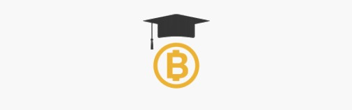

#### BTES - Blockchain Technology Education Software

 
BTES is an educational web-based platform about blockchain technology. BTES will serve a sandbox simulation environment, enabling total control. Various control options will include pausing, undoing/redoing, inspecting the simulation, controlling the timescale, and so on. This sandbox control will grant the user with the ability to truly understand each step of the execution and how they fit together. It will also provide numerous interactive lessons that will step-by-step explain how a blockchain works. BTES will guide the user throughout the lesson with the help of informational prompts, automated execution control, various highlights, and so on. These lessons will help beginners to quickly start learning about the critical topics with an easy to follow structure.
  

*You can select a topic from the topic list.*

# $$$TABLE_OF_CONTENTS$$$
